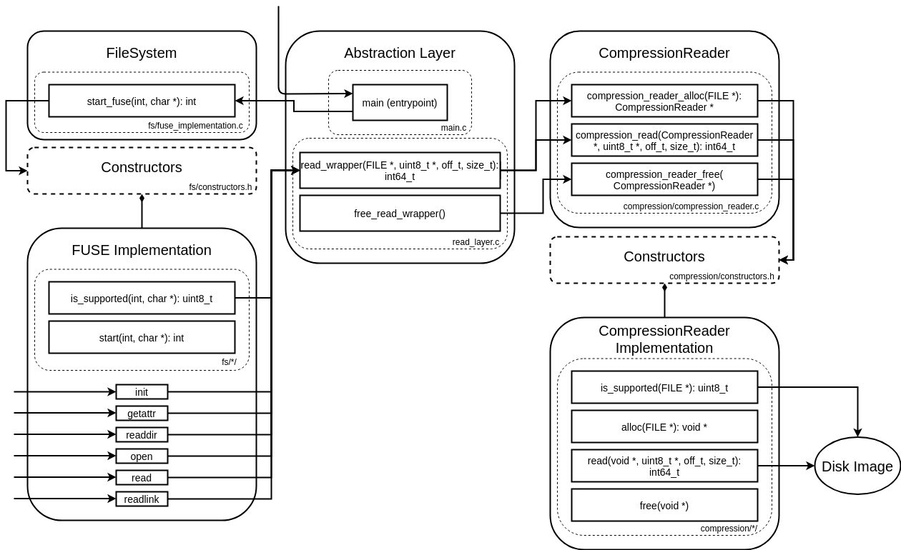

# Spotlight Framework

## Architectural Diagram

## Directory structure

* [src/](../src/) - Spotlight source code.
  * [compression/](../src/compression/) - Compression reader component.
  * [examples/](../src/examples/) - Source code for example programs.
  * [fs/](../src/fs/) - Filesystem component.
  * [libs/](../src/libs/) - External libraries.
  * [Makefile](../src/Makefile) - Builds Spotlight.
  * [main.c](../src/main.c) - Program entrypoint into Spotlight.
  * [read_layer.c](../src/read_layer.c) - C implementation of abstraction layer in Spotlight.
  * [read_layer.h](../src/read_layer.h) - Function prototypes for exposed abstraction layer functions.
* [tests/](../tests/) - Spotlight framework tests.
  * [Makefile](../tests/Makefile) - Makefile for running tests of Spotlight.
  * [README.md](../tests/README.md) - Instructions for running tests.
  * [test-compressed-fs/](../tests/test-compressed-fs/) - End to end tests.
  * [test-compression/](../tests/test-compression/) - Tests for only compression component.
  * [test-fs/](../tests/test-fs/) - Test for filesystem component with compression passthrough.
